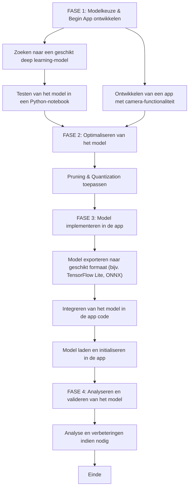

```mermaid
graph TD;
    A[FASE 1: Modelkeuze & Begin App ontwikkelen] --> B[Ontwikkelen van een app met camera-functionaliteit]
    A --> C[Zoeken naar een geschikt deep learning-model]

    C --> D[Testen van het model in een Python-notebook]
    D & B --> E[FASE 2: Optimaliseren van het model]

    E --> F[Pruning & Quantization toepassen]

    F --> G[FASE 3: Model implementeren in de app]
    G --> H["Model exporteren naar geschikt formaat (bijv. TensorFlow Lite, ONNX)"]
    H --> I[Integreren van het model in de app code]
    I --> J[Model laden en initialiseren in de app]

    J --> L[FASE 4: Analyseren en valideren van het model]
    L --> M[Analyse en verbeteringen indien nodig]
    M --> N[Einde]

```
