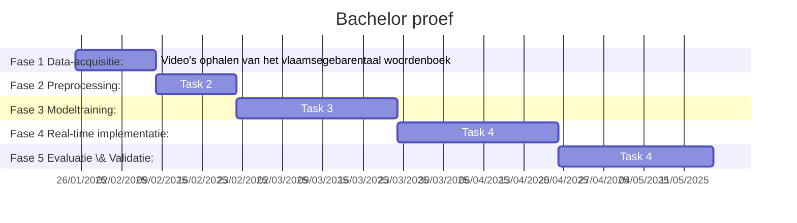

# GANTT Diagram

```mermaid
gantt
    title Bachelor proef
    dateFormat  DD/MM/YYYY
    axisFormat  %d/%m/%Y
    todayMarker off

    section Fase 1 Data-acquisitie:
    Video's ophalen van het vlaamsegebarentaal woordenboek:          des1, 25/01/2025, 08/02/2025

    section Fase 2 Preprocessing:
    Task 2       :          des2, 08/02/2025, 22/02/2025

    section Fase 3 Modeltraining:
    Task 3       :         des3, 22/02/2025, 22/03/2025

    section Fase 4 Real-time implementatie:
    Task 4       :         des4, 22/03/2025, 19/04/2025

    section Fase 5 Evaluatie \& Validatie:
    Task 4       :         des4, 19/04/2025, 16/05/2025
```
