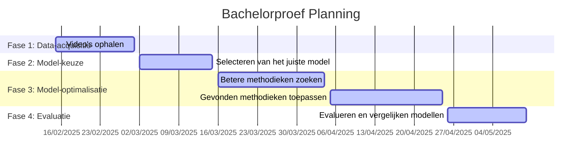

# GANTT Diagram

```mermaid
gantt
    title Bachelorproef Planning
    dateFormat  DD/MM/YYYY
    axisFormat  %d/%m/%Y
    todayMarker off

    section Fase 1: Data-acquisitie
    Video's ophalen             :active, des1, 15/02/2025, 01/03/2025

    section Fase 2: Model-keuze
    Selecteren van het juiste model :active, des2, 02/03/2025, 15/03/2025

    section Fase 3: Model-optimalisatie
    Betere methodieken zoeken   :active, des3, 16/03/2025, 04/04/2025
    Gevonden methodieken toepassen :active, des4, 05/04/2025, 25/04/2025

    section Fase 4: Evaluatie
    Evalueren en vergelijken modellen  :active, des5, 26/04/2025, 10/05/2025

```
