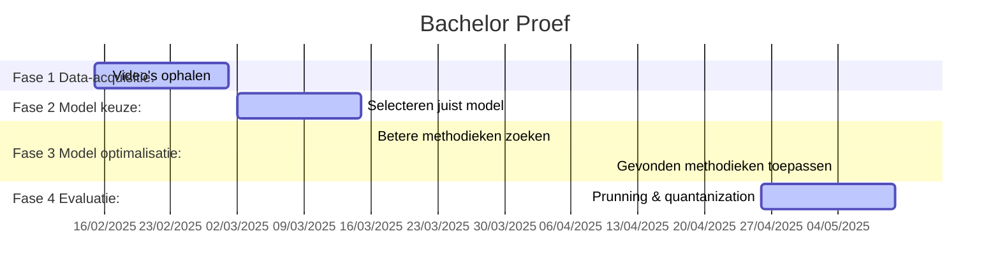

# GANTT Diagram

```mermaid
gantt
    title Bachelor Proef
    dateFormat  DD/MM/YYYY
    axisFormat  %d/%m/%Y
    todayMarker off

    section Fase 1 Data-acquisitie:
    Video's ophalen: active, des1, 15/02/2025, 01/03/2025

    section Fase 2 Model keuze:
    Selecteren juist model: active, des2, 02/03/2025,  15/03/2025

    section Fase 3 Model optimalisatie:
    Betere methodieken zoeken: active, des3, 16/03/2025, 4/04/2025
    Gevonden methodieken toepassen: active, des4, 5/04/2025, 25/04/2025

    section Fase 4 Evaluatie:
    Prunning & quantanization: active, des5, 26/04/2025, 10/05/2025

```
