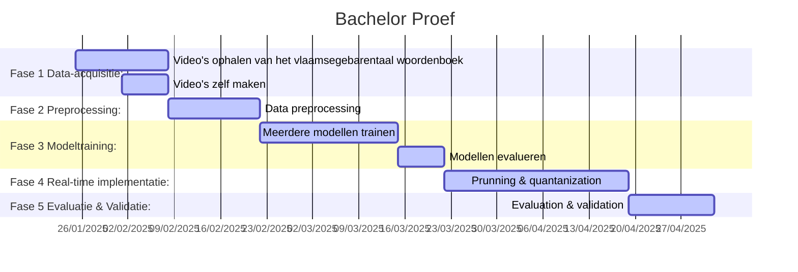

# GANTT Diagram

```mermaid
gantt
    title Bachelor Proef
    dateFormat  DD/MM/YYYY
    axisFormat  %d/%m/%Y
    todayMarker off

    section Fase 1 Data-acquisitie:
    Video's ophalen van het vlaamsegebarentaal woordenboek: active, des1, 25/01/2025, 08/02/2025
    Video's zelf maken: active, des2, 01/02/2025, 08/02/2025

    section Fase 2 Preprocessing:
    Data preprocessing: active, des3, 08/02/2025, 22/02/2025

    section Fase 3 Modeltraining:
    Meerdere modellen trainen: active, des5, 22/02/2025, 15/03/2025
    Modellen evalueren: active, des6, 15/03/2025, 22/03/2025

    section Fase 4 Real-time implementatie:
    Prunning & quantanization: active, des7, 22/03/2025, 19/04/2025

    section Fase 5 Evaluatie & Validatie:
    Evaluation & validation: active, des8, 19/04/2025, 02/05/2025


```
